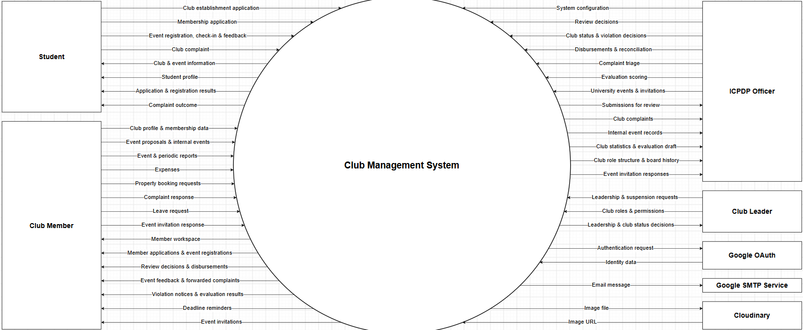

# Q&A — Context Diagram v2.1 (UCMS)

> **Sơ đồ:** [`03-diagrams/UCMS_Context_Diagram_v2.1.drawio`](03-diagrams/UCMS_Context_Diagram_v2.1.drawio) —
> bản hiện hành, **46 luồng dữ liệu, 7 thực thể ngoài** (đã gồm 4 luồng mời sự kiện cấp trường của I61 và 2 luồng xuất dữ liệu của I64).
> **Bảng luồng → use case:** [`SRS.md` §14.4](SRS.md#144-luồng-dữ-liệu-context--use-case).
> **Lịch sử thay đổi:** review issue I56 (gộp luồng), I57 (sự kiện nội bộ), I58 (tách Club Leader), I61 (sự kiện cấp trường).

---

## Đọc hình trong 30 giây

> Context diagram là DFD mức 0: toàn bộ UCMS là **một tiến trình duy nhất** ở giữa, xung quanh là
> các thực thể bên ngoài trao đổi dữ liệu với nó. Có **7 thực thể**: 4 nhóm người dùng — Student,
> Club Member, Club Leader, ICPDP Officer — và 3 hệ thống ngoài — Google OAuth để đăng nhập, Google
> SMTP để gửi email, Cloudinary để lưu ảnh.
>
> Có **46 luồng**. Mỗi luồng là **một nhóm dữ liệu**, gọi tên bằng danh từ, đi một chiều, một mũi tên
> thẳng. Bên trái là phía sinh viên và CLB, chủ yếu **gửi hồ sơ vào**. Bên phải là ICPDP, **nhận hồ sơ
> để duyệt và trả quyết định về**. Chi tiết từng luồng ứng với use case nào nằm ở bảng SRS §14.4.

---

## Bảng luồng (để tra khi bị hỏi)

| Thực thể | Vào hệ thống | Ra khỏi hệ thống | Tổng |
|---|---|---|---|
| Student | Club establishment application · Membership application · Event registration, check-in & feedback · Club complaint | Club & event information · Student profile · Application & registration results · Complaint outcome | 8 |
| Club Member | Club profile & membership data · Event proposals & internal events · Event & periodic reports · Expenses · Property booking requests · Complaint response · Leave request · Event invitation response | Member workspace · Member applications & event registrations · Review decisions & disbursements · Event feedback & forwarded complaints · Violation notices & evaluation results · Deadline reminders · Event invitations | 15 |
| Club Leader | Leadership & suspension requests · Club roles & permissions | Leadership & club status decisions | 3 |
| ICPDP Officer | System configuration · Review decisions · Club status & violation decisions · Disbursements & reconciliation · Complaint triage · Evaluation scoring · University events & invitations · Export criteria | Submissions for review · Club complaints · Internal event records · Club statistics & evaluation draft · Club role structure & board history · Event invitation responses · Exported data & reports | 15 |
| Google OAuth | Identity data | Authentication request | 2 |
| Google SMTP | — | Email message | 1 |
| Cloudinary | Image URL | Image file | 2 |
| | | **Tổng** | **44** |

---

## 1. Khái niệm và ký hiệu

**Hỏi: Context diagram dùng để làm gì? Khác use case diagram chỗ nào?**
Context diagram trả lời *dữ liệu gì đi qua biên hệ thống, giữa hệ thống và ai*. Use case diagram trả
lời *ai làm được chức năng gì*. Context diagram không có chức năng, chỉ có dữ liệu; use case diagram
không có dữ liệu, chỉ có chức năng. Hai sơ đồ được nối với nhau bằng bảng SRS §14.4: mỗi luồng ánh
xạ tới ít nhất một use case.

**Hỏi: Sao chỉ có một hình tròn ở giữa? Không vẽ các module bên trong à?**
Đây là DFD mức 0: cả hệ thống là một hộp đen. Phân rã bên trong (module, kho dữ liệu, tiến trình con)
thuộc DFD mức 1 trở xuống hoặc sơ đồ kiến trúc, không thuộc context diagram.

**Hỏi: Sao không có data store (database) trên hình?**
Data store là thứ **bên trong** hệ thống. Context diagram chỉ vẽ những gì nằm ngoài biên. Ngay cả
Cloudinary — nơi lưu ảnh — cũng được vẽ là thực thể ngoài vì nó là dịch vụ của bên thứ ba, không
thuộc UCMS.

**Hỏi: Sao nhãn luồng là danh từ, không phải động từ?**
Luồng thể hiện **dữ liệu**, không phải hành động. Bản v2 từng có nhãn kiểu `Send email request`,
`Member management`; v2.1 đổi hết sang danh từ: `Email message`, `Club profile & membership data` (I56).

**Hỏi: Sao mỗi luồng một mũi tên một chiều, không dùng mũi tên hai đầu?**
Dữ liệu vào và dữ liệu ra là hai thứ khác nhau. Ví dụ Student gửi `Membership application` nhưng nhận
về `Application & registration results`. Gộp vào một mũi tên hai đầu sẽ mất thông tin.

**Hỏi: Sao một luồng gộp nhiều thứ, như "Event registration, check-in & feedback"?**
Context diagram vẽ dữ liệu ở **mức nhóm**. Bản v2 vẽ gần như mỗi use case một luồng — 57 luồng — và
bị nhận xét là quá nhiều chữ. v2.1 gộp các dữ liệu cùng chủ đề, cùng người gửi thành một luồng.
Chi tiết theo từng use case đã có ở use case diagram và bảng SRS §14.4.

---

## 2. Thực thể ngoài

**Hỏi: Sao Club Member và Club Leader là hai thực thể riêng?**
Vì họ trao đổi dữ liệu khác nhau. Chỉ chủ nhiệm gửi đề cử ban, kế hoạch bàn giao, xin tạm dừng, cấu
hình role và quyền, và chỉ chủ nhiệm nhận quyết định về ban và trạng thái CLB. Các dữ liệu vận hành
còn lại thì thành viên có quyền phù hợp đều gửi được, nên nằm ở Club Member.

**Hỏi: Club Leader chỉ có 3 luồng — vậy chủ nhiệm không nộp đề xuất sự kiện à?**
Có. Chủ nhiệm cũng là Club Member (quan hệ kế thừa trên use case diagram), nên mọi luồng của Club
Member cũng áp dụng cho chủ nhiệm. Context diagram không có ký hiệu kế thừa, nên chỉ vẽ ở Club Leader
những luồng **riêng** của chủ nhiệm, tránh vẽ trùng.

**Hỏi: Tương tự, Club Member cũng là Student — sao không vẽ lại luồng của Student?**
Cùng lý do: chỉ vẽ luồng phát sinh từ vai trò đó. Thành viên vẫn ứng tuyển CLB khác, đăng ký sự kiện…
qua các luồng của Student.

**Hỏi: Sao không có Guest?**
Guest chỉ đọc trang công khai, không gửi dữ liệu gì vào hệ thống. Phần Guest đọc được là một phần
của `Club & event information`. Nguyên tắc: xem công khai, hành động phải đăng nhập — khi đó người dùng
đã là Student.

**Hỏi: Phòng Tài chính, Cơ sở vật chất, An ninh sao không có?**
Họ không dùng hệ thống. ICPDP hỏi ý kiến họ bên ngoài rồi ghi vào ghi chú thẩm định. Không có dữ
liệu nào đi trực tiếp giữa họ và UCMS.

**Hỏi: ICPDP Head (duyệt cấp 2) sao không là thực thể riêng?**
Cấp 2 là một quyền RBAC trong nội bộ ICPDP, cấu hình qua `System configuration` (định tuyến phê
duyệt). Dữ liệu cấp 2 trao đổi giống hệt cấp 1 — nhận `Submissions for review`, gửi `Review decisions` —
nên vẽ chung là ICPDP Officer.

**Hỏi: Sao không có Scheduler / System là thực thể?**
Scheduler nằm **bên trong** hệ thống, không phải bên ngoài. Dữ liệu nó sinh ra (như nhắc hạn) xuất
hiện dưới dạng luồng ra, ví dụ `Deadline reminders`.

**Hỏi: Ngân hàng / cổng thanh toán đâu? Có luồng giải ngân mà.**
UCMS không chuyển tiền, chỉ **ghi nhận và theo dõi**. ICPDP chuyển tiền ngoài hệ thống, rồi nhập số
liệu vào qua `Disbursements & reconciliation`. Không có hệ thống thanh toán nào kết nối với UCMS.

**Hỏi: Hệ thống đào tạo / quản lý sinh viên của trường đâu?**
Không tích hợp. Danh tính sinh viên lấy từ Google OAuth (email theo domain trường); thông tin thêm do
người dùng tự nhập vào hồ sơ.

---

## 3. Ba hệ thống ngoài

**Hỏi: Luồng Google OAuth đi thế nào?**
UCMS gửi `Authentication request` sang Google; người dùng đăng nhập ở Google; Google trả về
`Identity data` — email, họ tên, ảnh đại diện. UCMS kiểm tra domain email rồi tạo phiên. **UCMS không
bao giờ nhận hay lưu mật khẩu**, nên không có luồng mật khẩu nào trên hình.

**Hỏi: Sao Student không có luồng "Login credentials" vào hệ thống?**
Vì người dùng nhập thông tin đăng nhập **ở Google**, không ở UCMS. Dữ liệu danh tính đến UCMS từ Google
qua `Identity data`.

**Hỏi: Sao Google SMTP chỉ có một chiều ra?**
UCMS chỉ gửi `Email message` để SMTP chuyển tới hộp thư người dùng. Hệ thống không đọc email đến và
không dựa vào phản hồi của SMTP cho nghiệp vụ nào. Gửi lỗi thì UCMS tự thử lại (outbox) — đó là xử lý
bên trong.

**Hỏi: Email gửi cho sinh viên mà sao mũi tên chỉ tới SMTP, không tới Student?**
Trên context diagram, luồng kết thúc ở thực thể ngoài **trực tiếp** nhận dữ liệu từ hệ thống. UCMS đưa
email cho SMTP; việc SMTP giao tới hộp thư nằm ngoài biên hệ thống. Thông báo trong ứng dụng thì nằm
trong các luồng ra của từng actor (results, decisions, reminders…).

**Hỏi: Cloudinary làm gì, sao có hai chiều?**
Lưu ảnh tải lên: logo CLB, ảnh sự kiện, ảnh minh chứng. UCMS gửi `Image file`, Cloudinary trả lại
`Image URL`; UCMS chỉ lưu URL. Hai chiều vì cả hai dữ liệu đều cần cho nghiệp vụ.

**Hỏi: Sao Cloudinary và SMTP không có trên use case diagram?**
Chúng không tham gia use case nào như một actor, chỉ là hạ tầng. Google OAuth thì có, vì nó là actor
hỗ trợ trực tiếp của use case đăng nhập.

**Hỏi: Chứng từ chi tiêu (PDF) có lên Cloudinary không?**
Luồng trên hình là `Image file`. Nếu bị hỏi về file không phải ảnh: trả lời theo phạm vi tài liệu —
Cloudinary dùng cho ảnh tải lên; nếu chưa chốt cách lưu file khác thì nói thẳng là đang ở phần thiết kế.

---

## 4. Luồng của Student

**Hỏi: `Student profile` đi ra từ đâu?**
Từ lần đăng nhập đầu tiên: hệ thống tạo hồ sơ sinh viên từ `Identity data`, rồi hiển thị trên
dashboard. Luồng này ứng với UC01, UC02.

**Hỏi: `Application & registration results` gồm những gì?**
Kết quả hồ sơ thành lập CLB, kết quả ứng tuyển thành viên, kết quả đăng ký sự kiện và thay đổi từ danh
sách chờ (UC08, UC18, UC20, UC29, UC30).

**Hỏi: Sinh viên khiếu nại thì nhận lại gì?**
`Complaint outcome` — kết quả phân loại của ICPDP: bác bỏ, chuyển CLB, hay mở vụ việc (UC51).

**Hỏi: Feedback sự kiện có quay lại sinh viên không?**
Không. Feedback đi vào hệ thống, rồi được tổng hợp gửi cho CLB qua `Event feedback & forwarded
complaints`. Sinh viên chỉ là nguồn gửi.

---

## 5. Luồng của Club Member

**Hỏi: `Event proposals & internal events` — sao ghép chung?**
Cả hai đều là dữ liệu sự kiện do CLB tạo. Khác ở chỗ: đề xuất có ngân sách thì đi ICPDP duyệt; sự
kiện nội bộ không có ngân sách thì được ghi nhận thẳng (BR53). Ngân sách sự kiện cũng nằm trong luồng
này — không có luồng "budget request" riêng.

**Hỏi: `Expenses` gửi gì?**
Các khoản chi kèm chứng từ, và bản quyết toán sau sự kiện (UC36).

**Hỏi: `Review decisions & disbursements` gửi cho CLB những gì?**
Quyết định của ICPDP về đề xuất sự kiện, báo cáo sự kiện, báo cáo định kỳ, booking, và các lần giải
ngân / cấp bù / số phải hoàn (UC26, UC34, UC35, UC39, UC46).

**Hỏi: `Deadline reminders` do ai sinh ra? Không có use case nào à?**
Do scheduler bên trong hệ thống, theo deadline ICPDP cấu hình (UC04). Nhắc hạn là chức năng hệ thống,
không phải use case vì không có actor người — nhưng dữ liệu nó gửi ra thì vẫn phải có trên context diagram.

**Hỏi: `Violation notices & evaluation results` — CLB nhận vi phạm và đánh giá cùng một luồng?**
Cả hai đều là kết quả giám sát của ICPDP gửi xuống CLB (UC40, UC43), nên gộp một nhóm.

**Hỏi: `Event invitations` và `Event invitation response` là gì?**
Sự kiện cấp trường do ICPDP tổ chức (Club Day, hội thao…). ICPDP tạo sự kiện và mời CLB (UC53); CLB
nhận `Event invitations`, trả lời chấp nhận / từ chối qua `Event invitation response` (UC54); ICPDP xem
tổng hợp qua `Event invitation responses`. Lời mời quá hạn tự `Expired` (BR59).

**Hỏi: Sao lời mời gửi tới Club Member, không tới Club Leader?**
Người có quyền `club.event.manage` trả lời được, không nhất thiết là chủ nhiệm. Chủ nhiệm kế thừa Club
Member nên cũng nhận được.

---

## 6. Luồng của Club Leader

**Hỏi: `Leadership & suspension requests` gồm những gì?**
Đề cử ban chủ nhiệm (UC10), kế hoạch bàn giao nhiệm kỳ (UC12), yêu cầu tạm dừng CLB (UC14).

**Hỏi: `Club roles & permissions` gửi vào để làm gì? Có ai duyệt không?**
Chủ nhiệm tạo role, chọn quyền, gán thành viên (UC23). Không cần duyệt; mỗi thay đổi tạo một phiên
bản cơ cấu mới. ICPDP xem lịch sử qua `Club role structure & board history` (BR56).

**Hỏi: `Leadership & club status decisions` khác `Club status & violation decisions` thế nào?**
Cùng dữ liệu nhìn từ hai phía: ICPDP **gửi vào** quyết định (`Club status & violation decisions`,
`Review decisions`), hệ thống lưu lại và **gửi ra** cho chủ nhiệm phần liên quan đến CLB mình
(`Leadership & club status decisions` — UC11, UC13, UC15).

---

## 7. Luồng của ICPDP

**Hỏi: `Submissions for review` gồm những gì?**
Tất cả hồ sơ chờ ICPDP: hồ sơ thành lập, đề cử ban, bàn giao, xin tạm dừng, đề xuất sự kiện, báo cáo
sự kiện, quyết toán, báo cáo định kỳ, yêu cầu booking. Bản v2 vẽ mỗi loại hai lần (CLB → hệ thống →
ICPDP); v2.1 gộp phía ICPDP thành một luồng.

**Hỏi: Sao ICPDP gửi `Review decisions` vào hệ thống mà không gửi thẳng cho CLB?**
Trong DFD, thực thể ngoài không trao đổi trực tiếp với nhau trên sơ đồ — mọi dữ liệu đều đi qua hệ
thống. Hệ thống lưu quyết định, ghi audit, rồi phát ra cho đúng người.

**Hỏi: `System configuration` gồm những gì?**
Tài khoản và vai trò (UC03), chính sách và deadline (UC04), định tuyến phê duyệt (UC05), scheme đánh
giá (UC41), danh mục cơ sở vật chất (UC44).

**Hỏi: `Internal event records` là gì, sao ICPDP cần?**
Sự kiện nội bộ CLB được ghi nhận thẳng, không qua duyệt (BR53). ICPDP vẫn nhận bản ghi kèm điểm danh,
chỉ đọc, để không có hoạt động nào nằm ngoài tầm nhìn của nhà trường (I57).

**Hỏi: `Club statistics & evaluation draft` vs `Evaluation scoring`?**
Hệ thống gửi ra số liệu và bản nháp đánh giá tự sinh từ dữ liệu vận hành (UC02, UC42). ICPDP gửi vào
điểm chấm tay, điều chỉnh và quyết định công bố (UC43).

**Hỏi: `University events & invitations` là gì?**
ICPDP tạo sự kiện cấp trường và danh sách CLB được mời (UC53). Xem câu về `Event invitations` ở mục 5.

**Hỏi: `Export criteria` và `Exported data & reports` để làm gì?**
ICPDP chọn loại dữ liệu, bộ lọc và định dạng (`Export criteria`); hệ thống trả về file xlsx / csv /
pdf (`Exported data & reports`) để báo cáo lên nhà trường hoặc lưu trữ (UC55). Chỉ ICPDP được xuất,
mỗi lần xuất ghi audit, phản hồi ẩn danh không lộ danh tính (BR61).

---

## 8. Kiểm tra tính đầy đủ

**Hỏi: Làm sao biết sơ đồ không thiếu, không thừa luồng?**
Kiểm tra hai chiều với bảng SRS §14.4: mọi luồng phải được tạo ra hoặc dùng bởi ít nhất một use case,
và mọi use case trao đổi dữ liệu qua biên đều phải xuất hiện trong ít nhất một luồng.

**Hỏi: Lần sửa v2 → v2.1 đã thêm gì, bỏ gì?**
- **Bỏ thừa:** 57 → 35 luồng; 10 hồ sơ bị vẽ hai lần được gộp; nhãn hành động đổi thành danh từ.
- **Bổ sung thiếu:** `Complaint outcome` cho Student; `Violation notices & evaluation results`,
  `Review decisions & disbursements`, `Member applications & event registrations` cho CLB; `Club
  statistics & evaluation draft`, `Internal event records` cho ICPDP (I56, I57).
- Sau đó tách Club Leader (I58) → 40 luồng; thêm sự kiện cấp trường (I61) → 44 luồng; thêm xuất dữ liệu cho ICPDP (I64) → **46 luồng**.

**Hỏi: Sao Student nhận ít luồng hơn CLB?**
Sinh viên tương tác ít loại dữ liệu hơn: ứng tuyển, đăng ký, feedback, khiếu nại. CLB vận hành cả
tuyển thành viên, sự kiện, tài chính, báo cáo nên nhiều luồng hơn.

**Hỏi: Sao Student không nhận `Deadline reminders`?**
Nhắc hạn phục vụ nghĩa vụ của CLB (báo cáo, quyết toán, hoàn trả). Sinh viên không có nghĩa vụ có hạn
nào với hệ thống; nhắc lịch sự kiện đã đăng ký nằm trong `Application & registration results`.
*(Nếu hội đồng cho rằng nên có — nhận góp ý, đây là lựa chọn gộp nhóm, không sai về nghiệp vụ.)*

---

## Kiểm tra trước khi vào phòng

Commit `a8e3dbd` (thêm UC53, UC54) mới cập nhật một phần tài liệu. Những chỗ còn lệch:

- [ ] **Ảnh:** file PNG hiện hành `UCMS_Context_Diagram_v2.1_01_Context-diagram-v2.2.png` là ảnh
      chụp màn hình còn lưới nền, độ phân giải thấp, và tên file lệch quy ước
      `<tên-file-nguồn>_<số-trang>_<tên-trang>.png`. File `…_v2.1.png` cũ vẫn là bản 40 luồng. Nên
      xuất lại từ draw.io trước khi đưa vào báo cáo / slide.
- [ ] **Số luồng trong SRS lệch nhau:** §1 bảng tổng quan ghi 44, nhưng R5 và danh mục sơ đồ ở cuối
      SRS vẫn ghi 40.
- [ ] **Use case model và đặc tả chưa có UC53, UC54:** `02-use-cases/UCMS_UseCase_Model_v2.md` và
      `UCMS_UseCase_Specification_v2.md` vẫn ghi 52 use case; SRS ghi 54.
- [ ] **Use case diagram chưa vẽ UC53, UC54:** README sơ đồ ghi "phủ UC01–UC54" nhưng 9 ảnh PNG chưa
      đổi. Script `UC_Diagram_Presentation.md` vì vậy vẫn nói 52.
- [ ] **Docx báo cáo:** kiểm tra Figure III.1 là bản 44 luồng, và câu mô tả số luồng khớp.

Nếu bị hỏi về chênh lệch 52 / 54: UC53, UC54 (sự kiện cấp trường) được bổ sung sau cùng; các sơ đồ
và đặc tả đang được cập nhật theo.
