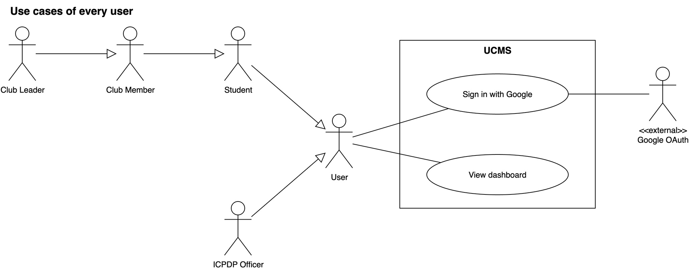
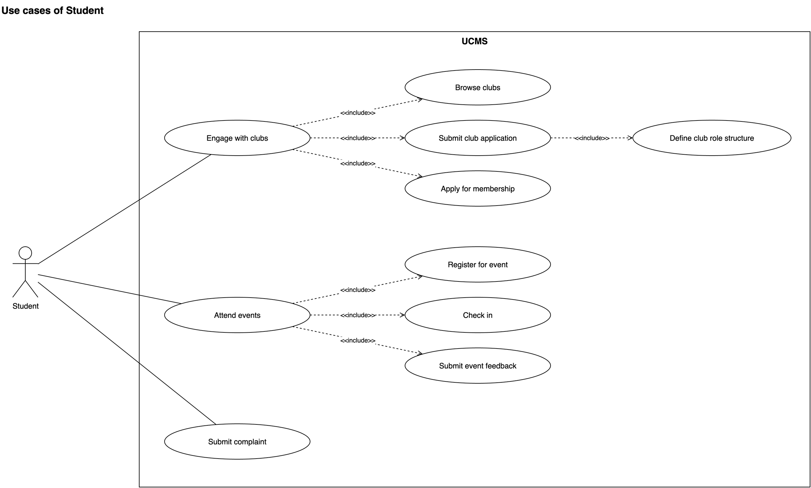
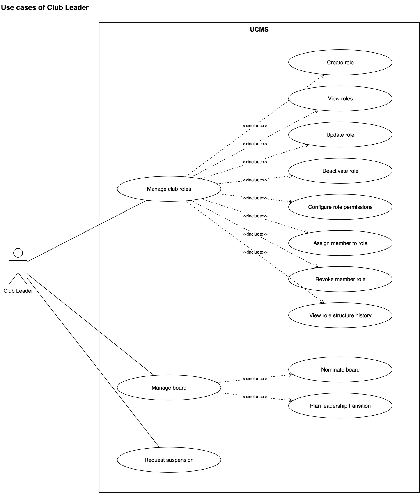
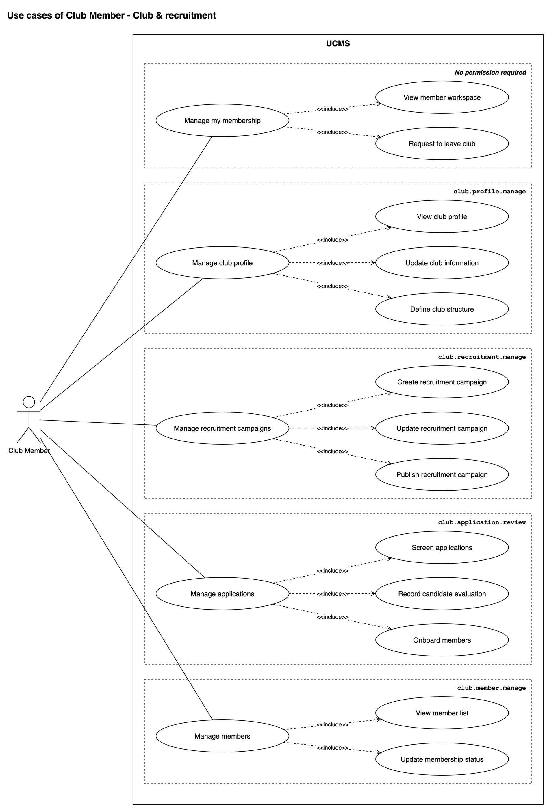
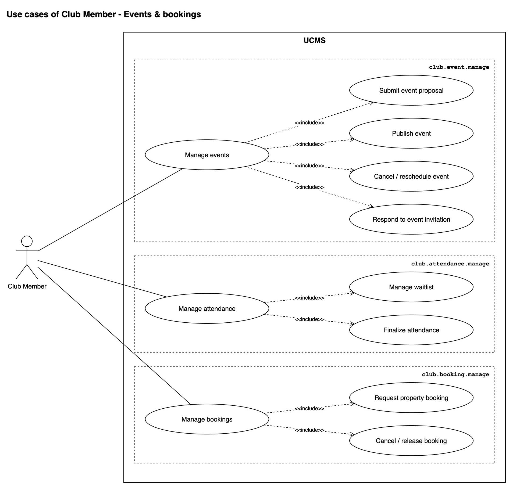
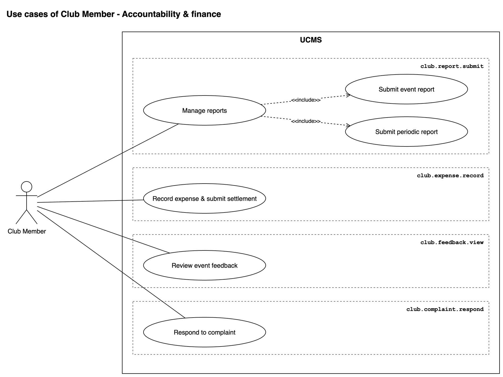
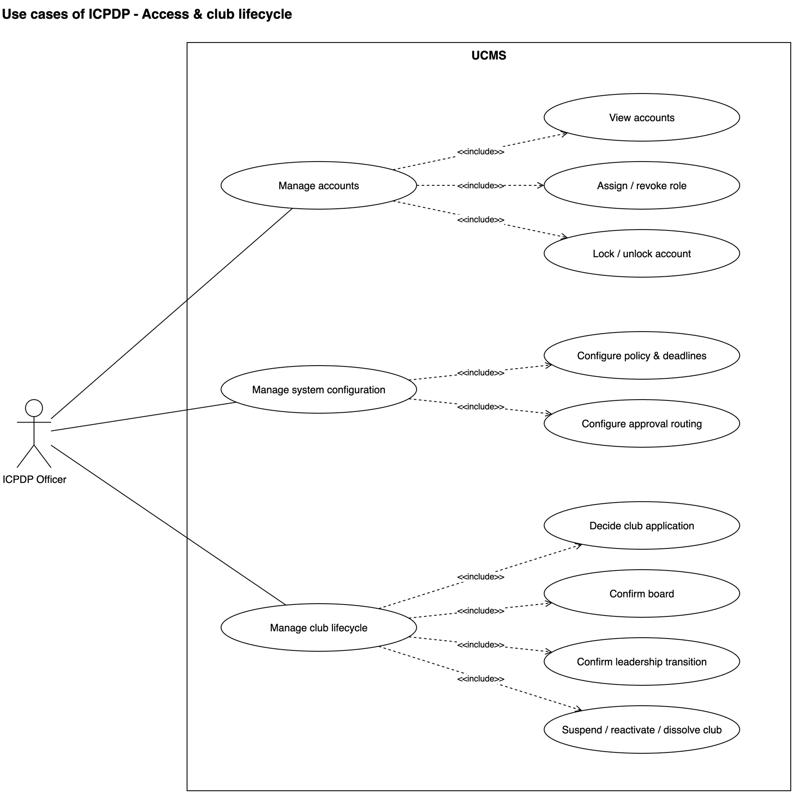
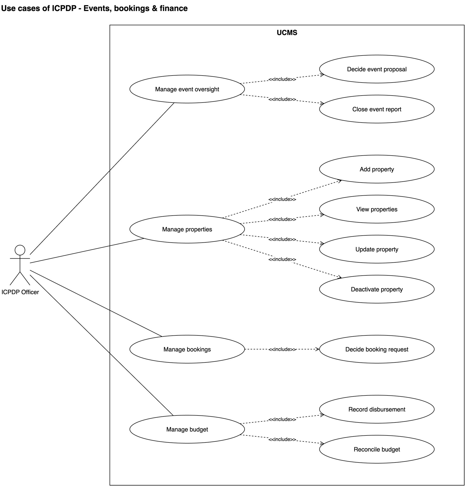
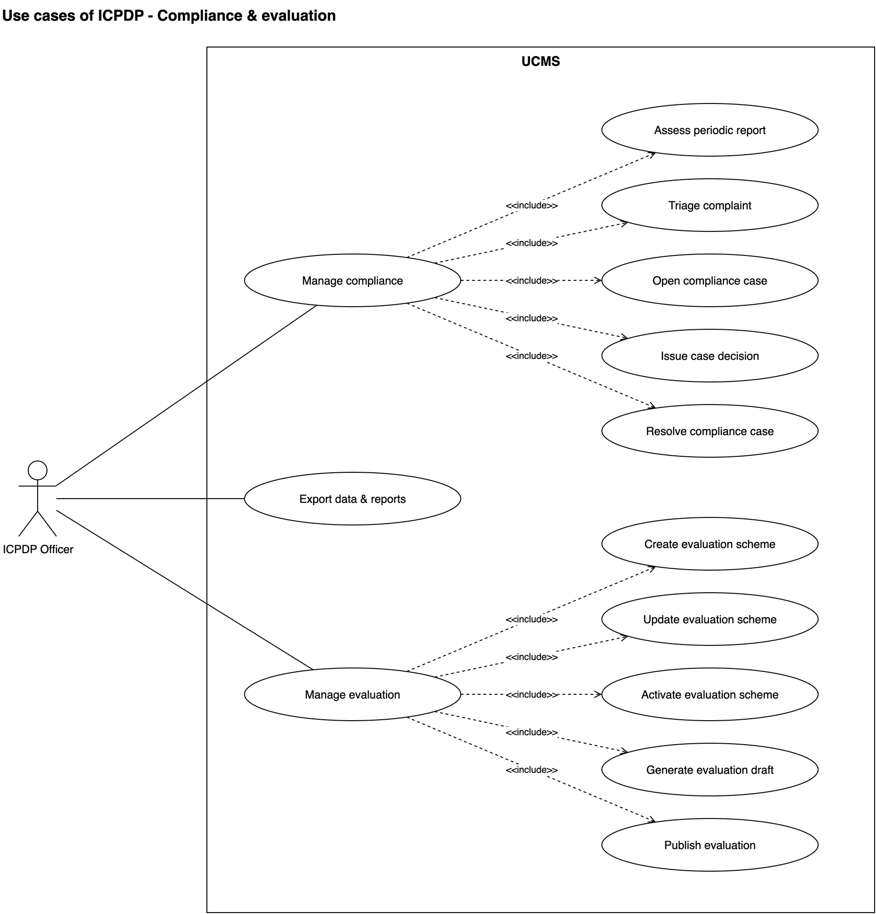

# Thuyết trình Use Case Diagram — UCMS

> **Nguồn:** `Group1_SE1939-NJ_Report_Final_v2.docx` — mục 2.2.1, Figure III.3.1 → III.3.9.
> Sơ đồ gốc: [`03-diagrams/UCMS_UseCase_ByActor.drawio`](03-diagrams/UCMS_UseCase_ByActor.drawio).
> Đặc tả tham chiếu khi bị hỏi sâu: [`02-use-cases/UCMS_UseCase_Model_v2.md`](02-use-cases/UCMS_UseCase_Model_v2.md) §3, §6, §7.
>
> **Thời lượng:** mở đầu ~45s, mỗi hình ~50–70s, kết ~30s → tổng **~9–10 phút**.
>
> **Cách dùng file này:** mỗi hình gồm 4 phần —
> 1. **Ảnh** để chiếu.
> 2. **Script** — đoạn trong khung trích dẫn là lời nói, đọc gần như nguyên văn.
> 3. **Bảng ánh xạ** — oval trên hình ↔ mã UC trong đặc tả. Không đọc, chỉ để tra khi bị hỏi.
> 4. **Q&A** — câu hỏi hay gặp cho riêng hình đó. Câu hỏi chung (ký hiệu UML, actor) ở cuối file.

---

## Mục lục

- [Mở đầu](#mở-đầu)
- [III.3.1 — Use cases of every user](#hình-iii31--use-cases-of-every-user)
- [III.3.2 — Student](#hình-iii32--student)
- [III.3.3 — Club Leader](#hình-iii33--club-leader)
- [III.3.4 — Club Member: Club & recruitment](#hình-iii34--club-member-club--recruitment)
- [III.3.5 — Club Member: Events & bookings](#hình-iii35--club-member-events--bookings)
- [III.3.6 — Club Member: Accountability & finance](#hình-iii36--club-member-accountability--finance)
- [III.3.7 — ICPDP: Access & club lifecycle](#hình-iii37--icpdp-officer-access--club-lifecycle)
- [III.3.8 — ICPDP: Events, bookings & finance](#hình-iii38--icpdp-officer-events-bookings--finance)
- [III.3.9 — ICPDP: Compliance & evaluation](#hình-iii39--icpdp-officer-compliance--evaluation)
- [Kết](#kết)
- [Q&A chung](#qa-chung)
- [Kiểm tra trước khi vào phòng](#kiểm-tra-trước-khi-vào-phòng)

---

## Mở đầu

*(Chưa chiếu hình, hoặc chiếu trang tiêu đề Figure III.3.)*

### Script

> Phần này trình bày use case diagram của hệ thống UCMS.
>
> Hệ thống có **4 actor người**: Student, Club Member, Club Leader và ICPDP Officer. Ngoài ra có
> **3 hệ thống bên ngoài**: Google OAuth, Google SMTP và Cloudinary. Trên use case diagram chỉ có
> Google OAuth, vì nó tham gia trực tiếp vào use case đăng nhập. SMTP chỉ là kênh gửi mail,
> Cloudinary chỉ là nơi lưu ảnh, nên hai hệ thống này nằm ở context diagram.
>
> Nhóm tách sơ đồ theo actor. Actor nào nhiều chức năng thì tách tiếp theo mảng nghiệp vụ, để
> mỗi hình vừa một trang. Tổng cộng **9 hình, phủ đủ 52 use case** được đặc tả ở mục 3.2.
>
> Mọi hình đọc theo cùng một cách: actor chỉ nối tới vài use case lớn dạng *"Manage …"*, và mỗi
> use case lớn **include** các chức năng con. Với chức năng kiểu danh mục, chức năng con được tách
> theo thêm, xem, sửa, ngừng kích hoạt.
>
> Có một nguyên tắc xuyên suốt cả 9 hình: **người nộp và người duyệt luôn là hai use case riêng**.
> Ví dụ Club Member nộp đề xuất sự kiện, còn ICPDP quyết định đề xuất đó. Nhờ vậy mỗi use case chỉ
> có một actor chính chịu trách nhiệm.

### Ghi chú cho người nói

- Câu "người nộp / người duyệt tách riêng" là sợi chỉ đỏ — nhắc lại ở hình 3, 7, 8 khi chỉ ra cặp tương ứng.
- Nếu hội đồng hỏi ngay "52 là đếm thế nào" → xem [bảng tổng](#bảng-tổng-52-use-case-theo-hình).

---

## Hình III.3.1 — Use cases of every user

### Script

> Hình đầu tiên cho thấy phần chung và quan hệ giữa các actor.
>
> Ở giữa là **User** — một actor trừu tượng. Student và ICPDP Officer đều kế thừa từ User.
>
> Phía trên là một chuỗi kế thừa: **Club Member kế thừa Student, Club Leader kế thừa Club Member**.
> Nghĩa là thành viên CLB vẫn là sinh viên, làm được mọi việc của sinh viên; chủ nhiệm vẫn là thành
> viên, làm được mọi việc của thành viên, cộng thêm quyền riêng.
>
> Mọi User có hai use case chung:
> - **Sign in with Google**: đăng nhập qua Google OAuth. Hệ thống kiểm tra domain email của trường,
>   lần đầu thì tự tạo hồ sơ sinh viên, rồi đưa người dùng vào workspace theo vai trò.
>   Hệ thống **không lưu mật khẩu**.
> - **View dashboard**: mỗi vai trò có một màn hình trả lời hai câu hỏi — *việc gì đang chờ tôi xử
>   lý*, và *những gì tôi đã nộp đang ở trạng thái nào*.
>
> Nhờ generalization, các hình sau không phải vẽ lại những use case đã kế thừa.

### Bảng ánh xạ

| Oval | Mã UC | Ghi chú |
|---|---|---|
| Sign in with Google | UC01 | Actor hỗ trợ: Google OAuth. BR32 (domain) |
| View dashboard | UC02 | Chỉ đọc, không chuyển trạng thái nào |

### Q&A

**Hỏi: Mũi tên generalization đi hướng nào?**
Tam giác rỗng chỉ về phía cha: Club Leader → Club Member → Student → User. Con kế thừa mọi
association của cha.

**Hỏi: Sao ICPDP Officer không kế thừa Student?**
ICPDP là cán bộ nhà trường, không phải sinh viên, không tham gia CLB, không đăng ký sự kiện. Chỉ
chung với sinh viên ở đăng nhập và dashboard, nên cả hai cùng kế thừa User.

**Hỏi: User là actor trừu tượng — vậy ai thực sự "là" User?**
Không ai đăng nhập với tư cách User thuần. User chỉ gom hai use case chung để không vẽ lặp 4 lần.

**Hỏi: Đăng nhập sai domain thì sao? Tài khoản bị khoá thì sao?**
Domain không được phép → từ chối, không tạo User, không tạo phiên, ghi audit lần thử. Tài khoản bị
ICPDP khoá ở UC03 → bị từ chối ngay ở UC01. Google không phản hồi → báo lỗi, không tạo phiên.

**Hỏi: Một người vừa là sinh viên vừa là thành viên CLB thì vào workspace nào?**
Luồng thay thế của UC01: người dùng có nhiều ngữ cảnh sẽ chọn workspace.

**Hỏi: Dashboard chỉ là một màn hình, sao tính là use case?**
Vì nó có mục tiêu nghiệp vụ riêng: cho mỗi vai trò biết việc đang chờ và trạng thái hồ sơ đã nộp.
Nguyên tắc của nhóm: việc đọc được tính là use case khi bản thân việc đọc là mục tiêu, không phải
một bước trong use case khác. Mọi con số trên dashboard là truy vấn trực tiếp, không sao chép dữ liệu.

**Hỏi: Dashboard có phụ thuộc đăng nhập không, sao không vẽ include?**
Đăng nhập là **tiền điều kiện** của dashboard, không phải một phần của nó. Include nghĩa là
"luôn chạy bên trong", nên không dùng ở đây.

---

## Hình III.3.2 — Student

### Script

> Student là bất kỳ sinh viên đã đăng nhập. Hình có 3 nhánh.
>
> **Nhánh 1 — Engage with clubs**, include:
> - **Browse clubs**: xem danh bạ CLB, trang CLB, đợt tuyển đang mở và sự kiện sắp tới.
> - **Submit club application**: nộp hồ sơ thành lập CLB mới, kèm danh sách thành viên sáng lập và
>   tài liệu bắt buộc. Use case này include tiếp **Define club role structure** — tức là sinh viên
>   đề xuất luôn cơ cấu chức vụ ban đầu của CLB, mỗi chức vụ được quyền gì.
> - **Apply for membership**: ứng tuyển vào một đợt tuyển của CLB.
>
> **Nhánh 2 — Attend events**, include **Register for event**, **Check in** và
> **Submit event feedback**. Chỉ người đã check-in mới gửi được feedback — để feedback phản ánh
> người thật sự có mặt.
>
> **Nhánh 3 — Submit complaint** nối thẳng với Student: khiếu nại về một CLB. Khiếu nại đi thẳng
> tới ICPDP, không qua CLB, để bảo vệ người khiếu nại.

### Bảng ánh xạ

| Oval | Mã UC | Quy tắc đáng nhớ |
|---|---|---|
| Browse clubs | UC06 | Liệt kê CLB `Active` và `Suspended` (đánh dấu); `Dissolved` ẩn (BR09) |
| Submit club application | UC07 | Tài liệu bắt buộc (BR02), số sáng lập viên tối thiểu (BR03), mỗi lần nộp là version mới (BR04) |
| Define club role structure | (bước của UC07) | Có sẵn role Chủ nhiệm + Members; không được cấp quyền riêng của leader cho role khác (BR55) |
| Apply for membership | UC17 | Trong khung nhận đơn (BR11), không nộp trùng (BR12), không bị `Banned` ở CLB đó (BR46) |
| Register for event | UC29 | Không vượt sức chứa trừ khi cho overbooking (BR17); đầy thì vào waitlist |
| Check in | UC31 | Mỗi người một bản ghi điểm danh / sự kiện (BR18) |
| Submit event feedback | UC48 | Mở từ lúc check-in (BR36), không sửa / xoá (BR37) |
| Submit complaint | UC50 | Đi thẳng tới ICPDP (BR38) |

### Q&A

**Hỏi: "Define club role structure" có phải use case riêng không?**
Không có mã riêng; nó là một phần bắt buộc của UC07 — hồ sơ thành lập luôn phải có cơ cấu role.
Vì bắt buộc nên vẽ include. Cơ cấu này được ICPDP thẩm định cùng hồ sơ ở UC08 và trở thành phiên
bản cơ cấu số 1 của CLB.

**Hỏi: Nộp hồ sơ thành lập bị yêu cầu sửa thì nộp lại ở đâu? Sao không có "Resubmit"?**
Nộp lại là luồng thay thế của chính UC07: cùng actor, cùng biểu mẫu, chỉ khác tiền điều kiện
(`Revision Requested`). Mỗi lần nộp lại tạo một version mới, version cũ không bị ghi đè. Ngoài ra
còn lưu nháp và rút hồ sơ trước khi có quyết định.

**Hỏi: Sinh viên chưa đăng nhập có xem CLB được không?**
Có. Guest xem được phần công khai của Browse clubs. Nhưng ứng tuyển, đăng ký, nộp hồ sơ đều đòi
đăng nhập. Nguyên tắc: *xem công khai, hành động phải đăng nhập*.

**Hỏi: Check-in do sinh viên tự làm hay CLB làm?**
Actor chính là Student — quét / xuất trình mã tại chỗ. Club Member có quyền là actor hỗ trợ, có thể
check-in hộ, và hệ thống lưu ai đã check-in hộ. Check-in trùng không tạo bản ghi thứ hai.

**Hỏi: Sao feedback mở từ lúc check-in chứ không phải sau khi CLB chốt điểm danh?**
Nếu đợi chốt điểm danh, CLB nào chốt muộn sẽ làm tỉ lệ phản hồi về 0, và phần đánh giá CLB sẽ
thiếu dữ liệu. Mở từ check-in thì feedback không phụ thuộc vào việc CLB có chốt đúng hạn hay không.

**Hỏi: Feedback có ẩn danh không? CLB có đọc được từng feedback không?**
Có tuỳ chọn ẩn danh. CLB chỉ thấy dạng tổng hợp, và chỉ khi đủ số người phản hồi tối thiểu (BR40).

**Hỏi: Khiếu nại sao không gửi thẳng cho CLB?**
Để bảo vệ người khiếu nại. ICPDP phân loại trước, chỉ chuyển cho CLB khi phù hợp; danh tính người
khiếu nại chỉ hiển thị ở mức chính sách cho phép.

**Hỏi: Đơn ứng tuyển / khiếu nại có rút được không?**
Có, cả hai đều có luồng rút (`Withdrawn`) trước khi có quyết định. Sinh viên theo dõi trạng thái ở dashboard.

---

## Hình III.3.3 — Club Leader

### Script

> Club Leader là chủ nhiệm CLB — người giữ ghế Chủ nhiệm đã được ICPDP xác nhận. Vì Club Leader kế
> thừa Club Member, chủ nhiệm có mọi quyền của CLB. Hình này **chỉ vẽ 4 quyền riêng** mà không role
> nào khác được giao.
>
> **Manage club roles** include Create, View, Update, Deactivate role, **Configure role
> permissions**, **Assign member to role**, **Revoke member role** và **View role structure history**.
> Nghĩa là chủ nhiệm tự dựng các chức vụ trong CLB, chọn quyền cho từng chức vụ từ một danh mục
> quyền cố định, rồi gán thành viên vào. Mỗi lần thay đổi tạo một **phiên bản cơ cấu mới**, không
> ghi đè bản cũ, nên luôn xem lại được lịch sử.
>
> **Manage board** include **Nominate board** — đề cử ban chủ nhiệm cho nhiệm kỳ — và **Plan
> leadership transition** — chuẩn bị bàn giao, kèm theo các nghĩa vụ còn dở như sự kiện, ngân sách,
> báo cáo.
>
> **Request suspension** nối thẳng: CLB chủ động xin tạm dừng hoạt động.
>
> Lưu ý: ở hình này chủ nhiệm **chỉ đề xuất**. Xác nhận ban chủ nhiệm, xác nhận bàn giao và quyết
> định tạm dừng đều thuộc ICPDP, ở hình III.3.7.

### Bảng ánh xạ

| Oval | Mã UC | Cặp duyệt bên ICPDP |
|---|---|---|
| Manage club roles + 8 chức năng con | UC23 | Không cần duyệt (ICPDP chỉ xem lịch sử) |
| Nominate board | UC10 | UC11 Confirm board |
| Plan leadership transition | UC12 | UC13 Confirm leadership transition |
| Request suspension | UC14 | UC15 Suspend / reactivate / dissolve |

### Q&A

**Hỏi: Sao tách Club Leader khỏi Club Member, không gộp thành 1 actor "CMB"?**
Vì quyền khác nhau thật: chủ nhiệm có 4 quyền không cấp được cho role nào — UC10, UC12, UC14, UC23
(BR55). Các việc vận hành còn lại thì ai làm được là do permission của role, nên gộp vào Club
Member. "CMB" vẫn dùng làm tên gọi chung cho phía CLB trong thông báo, dashboard.

**Hỏi: Chủ nhiệm có uỷ quyền quản lý role cho phó chủ nhiệm được không?**
Không. Danh mục quyền khi cấu hình role đã ẩn 4 quyền riêng của leader. Nếu cho uỷ quyền quản lý
role, người được uỷ quyền có thể tự cấp mọi quyền cho mình.

**Hỏi: Đổi role trong CLB có cần ICPDP duyệt không?**
Không. ICPDP đã thẩm định cơ cấu ban đầu ở hồ sơ thành lập, và xem được mọi phiên bản cơ cấu cùng
lịch sử ban chủ nhiệm ở chế độ chỉ đọc. Bắt duyệt mỗi lần đổi role sẽ làm ICPDP quá tải.

**Hỏi: Vậy chủ nhiệm có tự gán người vào ghế Phó chủ nhiệm được không?**
Không. Role ban điều hành thì chủ nhiệm đổi được permission, nhưng **người giữ** ghế chỉ đến từ đề
cử ban (UC10) và ICPDP xác nhận (UC11 / UC13). Thêm hay bỏ một role ban điều hành giữa nhiệm kỳ cũng
phải đi qua bàn giao (UC12 / UC13).

**Hỏi: CLB mới được duyệt, chưa có chủ nhiệm chính thức thì ai làm?**
Người đứng đơn nhận ghế tạm từ lúc ICPDP duyệt hồ sơ, khi CLB còn `Pending Setup`. Ghế tạm chỉ dùng
cho ba việc: cấu hình hồ sơ CLB, đề cử ban đầu tiên, quản lý role. Khi ICPDP xác nhận ban, ghế tạm
được thay bằng quyền chính thức.

**Hỏi: Các ràng buộc khi quản lý role?**
Chỉ gán thành viên `Active`; role một người giữ đã có người thì không gán thêm; không ngừng dùng
role còn người giữ; không xoá role Chủ nhiệm và Members; role Members tự gán khi onboard, không gán tay.

**Hỏi: Bàn giao nhiệm kỳ thì nghĩa vụ cũ (ngân sách, báo cáo dở) đi đâu?**
Gắn với CLB, không gắn với ban cũ. Kế hoạch bàn giao liệt kê chúng ra để ban mới tiếp nhận.

**Hỏi: Xin tạm dừng khi CLB còn sự kiện đã duyệt thì sao?**
Hệ thống cảnh báo và liệt kê những gì sẽ bị huỷ nếu ICPDP chấp thuận, nhưng không chặn việc nộp.

---

## Hình III.3.4 — Club Member: Club & recruitment

### Script

> Từ đây là Club Member. Club Member có nhiều chức năng nhất nên tách thành 3 hình.
>
> Điểm quan trọng trước khi đi vào hình: **mọi thành viên đều có workspace, nhưng các chức năng vận
> hành CLB chỉ chạy được khi role của thành viên đó có quyền tương ứng**. Đây là phân quyền theo
> role — RBAC. Ví dụ trưởng ban truyền thông có thể được giao quyền tạo đợt tuyển mà không cần là
> chủ nhiệm.
>
> - **Manage my membership** include **View member workspace** và **Request to leave club**. Hai
>   việc này mọi thành viên đều làm được, không cần quyền gì thêm.
> - **Manage club profile** include View club profile, Update club information và Define club
>   structure — hồ sơ CLB và các ban, bộ phận.
> - **Manage recruitment campaigns** include Create, Update và Publish recruitment campaign.
> - **Manage applications** include **Screen applications**, **Record candidate evaluation** theo
>   rubric, và **Onboard members** — tạo tư cách thành viên cho người trúng tuyển.
> - **Manage members** include View member list và **Update membership status**: Active và Inactive
>   chuyển qua lại; **Left** và **Banned** là trạng thái cuối.

### Bảng ánh xạ

| Oval | Mã UC | Permission cần (BR54) |
|---|---|---|
| View member workspace | UC24 | — (mọi thành viên `Active`/`Inactive`) |
| Request to leave club | UC22 | — (mọi thành viên) |
| View club profile / Update club information / Define club structure | UC09 | `club.profile.manage` |
| Create / Update / Publish recruitment campaign | UC16 | `club.recruitment.manage` |
| Screen applications | UC18 | `club.application.review` |
| Record candidate evaluation | UC19 | `club.application.review` |
| Onboard members | UC20 | `club.application.review` |
| View member list / Update membership status | UC21 | `club.member.manage` |

### Q&A

**Hỏi: Club Member có quyền tạo đợt tuyển hết à?**
Không. Actor trên hình là *ai có thể làm*; làm được hay không do permission của role (BR54). Thành
viên thường chỉ có workspace và xin rời CLB. Một người giữ nhiều role thì quyền là hợp các role.

**Hỏi: "Define club structure" ở đây khác gì "Define club role structure" ở hình Student?**
Hình Student: cơ cấu **chức vụ và quyền** đề xuất trong hồ sơ thành lập (UC07). Ở đây: các **ban,
bộ phận** của CLB đang hoạt động (UC09). Việc định nghĩa role và quyền sau khi CLB đã chạy thuộc
riêng chủ nhiệm (UC23).

**Hỏi: Request to leave và Update membership status sang Left khác gì nhau?**
UC22 là thành viên **xin** rời. Phía CLB **thực thi** ở UC21 bằng trạng thái `Left`, lúc đó mọi role
bị thu hồi. Nếu thành viên đang giữ ghế ban chủ nhiệm thì phải được thay qua đề cử / xác nhận trước.

**Hỏi: Banned khác Left thế nào?**
`Left` là tự rời. `Banned` là CLB buộc rời, bắt buộc có lý do, và sinh viên đó **không được ứng tuyển
lại** CLB này (BR46). Cả hai là trạng thái cuối.

**Hỏi: Inactive là gì, ai chuyển?**
Ngừng tham gia. Mỗi học kỳ CLB đăng ký lại thành viên hoạt động; ai không được xác nhận chuyển
`Inactive`. Thành viên `Inactive` vẫn vào workspace (được đánh dấu) và vẫn xin rời được.

**Hỏi: Kết quả sàng lọc đơn gồm những gì?**
`Accepted`, `Rejected` hoặc `Waitlisted`. Người trúng tuyển báo không tham gia thì CLB ghi `Declined`
ở bước onboard. Khi onboard, thành viên mới tự động giữ role Members.

**Hỏi: Rubric đánh giá ứng viên ở đâu ra?**
Cấu hình theo từng đợt tuyển.

**Hỏi: CLB đang bị tạm dừng có mở đợt tuyển được không?**
Không. Tạo đợt tuyển yêu cầu CLB `Active`; CLB `Suspended` không mở đợt tuyển và không hiện đợt tuyển nào.

**Hỏi: Có chat nội bộ, chia sẻ file trong workspace không?**
Không, nằm ngoài phạm vi. Workspace chỉ đọc: hồ sơ thành viên, role, sự kiện, lịch sử điểm danh,
nghĩa vụ còn treo.

---

## Hình III.3.5 — Club Member: Events & bookings

### Script

> Hình thứ hai của Club Member là sự kiện và đặt phòng.
>
> **Manage events** include:
> - **Submit event proposal**: nộp đề xuất sự kiện. **Ngân sách sự kiện nằm luôn trong đề xuất** —
>   đây là cách duy nhất để CLB xin kinh phí. Khi nộp, hệ thống tự kiểm tra xung đột lịch và báo
>   ba mức: không xung đột, cảnh báo, hoặc chặn.
> - **Publish event**: sau khi được duyệt thì công bố và mở đăng ký.
> - **Cancel / reschedule event**: huỷ hoặc đổi lịch, kèm mọi hệ quả — thông báo người đã đăng ký,
>   trả phòng, tính lại ngân sách.
> - **Manage waitlist**: quản lý sức chứa, đôn người từ danh sách chờ theo đúng thứ tự.
>
> **Manage bookings** include **Request property booking** và **Cancel / release booking**. Đặt phòng
> có thể gắn với một sự kiện hoặc đặt riêng.

### Bảng ánh xạ

| Oval | Mã UC | Quy tắc đáng nhớ |
|---|---|---|
| Submit event proposal | UC25 | Xung đột lịch BR15; ngân sách chỉ xin qua đây (BR22); CLB phải `Active` (BR10) |
| Publish event | UC27 | Chỉ khi `Approved` (BR14) → `Upcoming` |
| Cancel / reschedule event | UC28 | Huỷ sự kiện tự giải phóng booking (BR35) |
| Manage waitlist | UC30 | Đôn chỗ theo chính sách |
| Request property booking | UC45 | Không overbooking (BR33); CLB phải `Active` (BR34) |
| Cancel / release booking | UC47 | Huỷ sát giờ là tín hiệu tuân thủ |

### Q&A

**Hỏi: Budget request đâu? Sao không có use case xin ngân sách riêng?**
Ngân sách được gộp vào đề xuất sự kiện (UC25), ICPDP duyệt cả hai trong một lần (UC26). Sau đó là
giải ngân (UC35), quyết toán (UC36), đối soát (UC37). Tách riêng thì một sự kiện có hai hồ sơ song
song, dễ lệch nhau.

**Hỏi: Phát hiện xung đột lịch sao không là use case?**
Vì không có actor người. Nó là quy tắc nghiệp vụ BR15, chạy bên trong UC25 và UC45. Nguyên tắc của
nhóm: actor chính phải là con người, không bao giờ là "System".

**Hỏi: Đặt phòng kèm đề xuất sự kiện — sao không vẽ `<<extend>>`?**
Quan hệ đó có thật (UC45 mở rộng UC25, UC47 mở rộng UC28) và được ghi ở luồng thay thế trong đặc tả.
Không vẽ vì hai use case nằm ở hai nhóm "Manage" khác nhau, vẽ ra sẽ nối chéo và rối hình.

**Hỏi: Sự kiện nội bộ nhỏ cũng phải xin duyệt à?**
Không. Sự kiện `Internal` (chỉ cho thành viên) **không có ngân sách** thì được ghi nhận thẳng, không
qua ICPDP duyệt, có audit; ICPDP vẫn xem được trên dashboard (BR53). Có ngân sách thì vẫn phải duyệt.

**Hỏi: Đổi lịch có phải xin duyệt lại không?**
Có, khi chính sách yêu cầu: hệ thống kiểm tra xung đột lại và nộp lại để ICPDP quyết định.

**Hỏi: Huỷ sự kiện thì tiền đã tạm ứng thế nào?**
Ngân sách chưa giải ngân thì huỷ luôn. Đã tạm ứng thì CLB vẫn phải quyết toán, phần chưa chi bị thu
hồi khi đối soát (BR57, BR58).

**Hỏi: ICPDP có huỷ sự kiện của CLB được không? Sao ICPDP không phải actor của Cancel event?**
Có, nhưng là hệ quả của quyết định tạm dừng / giải thể CLB hoặc của hồ sơ vi phạm — luồng thay thế
A1 của UC28. ICPDP không phải actor của UC28 để giữ nguyên tắc mỗi use case một actor chính.

**Hỏi: Hết chỗ thì sao?**
Bật danh sách chờ thì người đăng ký sau vào `Waitlisted`; không bật thì đạt sức chứa là đóng đăng ký.
Số đăng ký xác nhận không bao giờ vượt sức chứa trừ khi chính sách cho phép overbooking (BR17).

**Hỏi: CLB có thể giữ phòng mãi không?**
Không. Booking không dùng nữa phải trả qua UC47; sự kiện huỷ thì booking tự giải phóng. Huỷ sát giờ
được ghi nhận làm tín hiệu tuân thủ.

---

## Hình III.3.6 — Club Member: Accountability & finance

### Script

> Hình cuối của Club Member là những gì CLB phải **giải trình** sau khi hoạt động.
>
> **Manage event accountability** include:
> - **Finalize attendance**: chốt và khoá điểm danh, tạo bộ dữ liệu điểm danh chính thức.
> - **Submit event report**: báo cáo sau sự kiện. Hệ thống điền sẵn đề xuất đã duyệt, điểm danh,
>   ngân sách và feedback; CLB chỉ nhập kết quả thực tế, minh chứng, sự cố và bài học.
> - **Review event feedback**: xem feedback dạng tổng hợp.
>
> **Record expense & submit settlement** nối thẳng: ghi từng khoản chi kèm chứng từ, rồi nộp quyết
> toán. Hệ thống tự tính đã tạm ứng bao nhiêu, đã chi bao nhiêu, còn dư bao nhiêu, khoản nào thiếu
> chứng từ.
>
> **Manage reports & complaints** include **Submit periodic report** — báo cáo hoạt động định kỳ theo
> học kỳ — và **Respond to complaint** — phản hồi khiếu nại mà ICPDP đã chuyển xuống.

### Bảng ánh xạ

| Oval | Mã UC | Quy tắc đáng nhớ |
|---|---|---|
| Finalize attendance | UC32 | Khoá dữ liệu; chỉ vai trò đặc biệt mở khoá (BR19) |
| Submit event report | UC33 | Có deadline (BR20); quá hạn kích hoạt cưỡng chế (BR21) |
| Review event feedback | UC49 | Chỉ tổng hợp (BR37), đủ số người tối thiểu (BR40) |
| Record expense & submit settlement | UC36 | Chi ngoài hạng mục bị gắn cờ (BR24); chứng từ theo hạng mục (BR25); hạn quyết toán (BR57) |
| Submit periodic report | UC38 | Hệ thống nạp sẵn sự kiện, thành viên, điểm danh, tài chính |
| Respond to complaint | UC52 | Có thời hạn; CLB không tự đóng khiếu nại |

### Q&A

**Hỏi: Sao "Record expense" và "Submit settlement" gộp một use case?**
Mỗi chứng từ tham chiếu đúng một khoản chi, và quyết toán là tổng hợp của chính các khoản chi đó —
cùng actor, cùng dữ liệu, một mục tiêu là chứng minh chi tiêu. Khi nộp quyết toán, bộ khoản chi bị
khoá. Nó không có chức năng con nên nối thẳng actor.

**Hỏi: Quá hạn báo cáo / quyết toán thì sao?**
Thành nghĩa vụ quá hạn. Nếu ICPDP bật công tắc cưỡng chế (BR21), CLB bị chặn nộp đề xuất sự kiện
mới cho tới khi hoàn thành. Quá hạn quyết toán thì ICPDP chốt dựa trên các khoản đã có chứng từ.

**Hỏi: Đã chốt điểm danh rồi phát hiện sai thì sửa thế nào?**
Chỉ một vai trò đặc biệt mới mở khoá được (BR19), và việc mở khoá có audit. Không để CLB tự sửa
tuỳ ý sau khi chốt, vì điểm danh là đầu vào đánh giá CLB.

**Hỏi: Sự kiện nội bộ có phải nộp báo cáo không?**
Không. Sự kiện nội bộ ghi nhận thẳng thì chốt điểm danh là đóng sự kiện luôn.

**Hỏi: Báo cáo định kỳ khác báo cáo sự kiện thế nào?**
Báo cáo sự kiện: một sự kiện, ngay sau khi diễn ra, ICPDP đóng ở UC34. Báo cáo định kỳ: cả học kỳ
hoặc năm học, ICPDP thẩm định ở UC39 và dùng làm đầu vào đánh giá.

**Hỏi: CLB phản hồi khiếu nại thì có biết ai khiếu nại không?**
Chỉ ở mức chính sách cho phép. CLB nộp phản hồi kèm chứng cứ, còn đóng hay leo thang là do ICPDP.

**Hỏi: Thủ quỹ là actor à?**
Không. Thủ quỹ là một role do chủ nhiệm tạo và cấp quyền `club.expense.record`. Actor vẫn là Club Member.

---

## Hình III.3.7 — ICPDP Officer: Access & club lifecycle

### Script

> Ba hình cuối là ICPDP Officer — **cơ quan duyệt duy nhất** của nhà trường. Các phòng Tài chính,
> Cơ sở vật chất, An ninh không dùng hệ thống; ICPDP hỏi ý kiến họ bên ngoài rồi ghi vào ghi chú
> thẩm định.
>
> - **Manage accounts** include View accounts, **Assign / revoke role** và **Lock / unlock account**.
> - **Manage system configuration** include **Configure policy & deadlines** — domain email, deadline,
>   ngưỡng, lịch học kỳ — và **Configure approval routing**: quy định hồ sơ nào phải duyệt thêm cấp 2
>   trong ICPDP, theo loại hồ sơ, số tiền và mức rủi ro.
> - **Manage club lifecycle** include **Decide club application**, **Confirm board**, **Confirm
>   leadership transition**, **Suspend / reactivate / dissolve club** và View club role structure &
>   board history.
>
> Nhóm Manage club lifecycle chính là **phía quyết định** của những gì Student và Club Leader đề xuất
> ở hình 2 và hình 3: hồ sơ thành lập, đề cử ban, bàn giao và xin tạm dừng.

### Bảng ánh xạ

| Oval | Mã UC | Cặp đề xuất |
|---|---|---|
| View accounts / Assign-revoke role / Lock-unlock account | UC03 | — |
| Configure policy & deadlines | UC04 | — |
| Configure approval routing | UC05 | — |
| Decide club application | UC08 | UC07 (Student) |
| Confirm board | UC11 | UC10 (Club Leader) |
| Confirm leadership transition | UC13 | UC12 (Club Leader) |
| Suspend / reactivate / dissolve club | UC15 | UC14 (Club Leader), hoặc hồ sơ vi phạm UC40 |
| View club role structure & board history | (phần ICPDP của UC02) | Chỉ đọc (BR56) |

### Q&A

**Hỏi: Assign role ở đây có cấp quyền trong CLB không?**
Không. UC03 chỉ cấp vai trò phía ICPDP và vai trò đặc biệt. Quyền trong CLB đến từ xác nhận ban
(UC11 / UC13) và từ chủ nhiệm gán role (UC23) (BR47). Tách như vậy để quyền CLB luôn gắn với một
quyết định nghiệp vụ.

**Hỏi: ICPDP Head (duyệt cấp 2) ở đâu?**
Không vẽ thêm actor. Cấp 2 là một quyền RBAC trong nội bộ ICPDP, cấu hình ở Configure approval
routing. Mọi cấp đều do ICPDP Officer thực hiện, nên ICPDP vẫn là cơ quan duyệt duy nhất. Hồ sơ không
khớp quy tắc nào thì chỉ cần một cấp.

**Hỏi: Cấu hình chính sách được sửa những gì?**
Domain email, số sáng lập viên tối thiểu, tài liệu bắt buộc, deadline báo cáo và mốc nhắc, ngưỡng
xung đột, cửa sổ feedback, chính sách overbooking, công tắc cưỡng chế, lịch học kỳ. Mọi thay đổi có
version và audit, và **không bao giờ viết lại một quyết định đã ra**.

**Hỏi: Thẩm định hồ sơ thành lập có mấy kết quả?**
Ba: yêu cầu chỉnh sửa (có nhận xét và deadline), phê duyệt (tạo CLB ở `Pending Setup`), từ chối (bắt
buộc lý do). Hết deadline chỉnh sửa mà không nộp lại thì hồ sơ `Expired`. ICPDP không sửa dữ liệu thay người nộp.

**Hỏi: Sao "Decide" là một use case, không tách Review / Approve / Reject?**
Vì đó là một phiên thẩm định của cùng một người, trên cùng một hồ sơ, cùng màn hình. Ba kết quả là
ba nhánh của một use case.

**Hỏi: Giải thể CLB có xoá ngay không?**
Không, giải thể có lịch. Học kỳ ra quyết định CLB vẫn chạy bình thường. Đầu học kỳ sau CLB sang
`Dissolving`: không tạo gì mới, chỉ hoàn tất việc tồn. Trước học kỳ tiếp theo, hệ thống đóng hết,
lưu trữ lịch sử và đặt `Dissolved`.

**Hỏi: Tạm dừng CLB ảnh hưởng gì?**
CLB `Suspended` không mở đợt tuyển, không nộp đề xuất sự kiện, không nhận booking mới; các đề xuất
chưa quyết định bị huỷ; sự kiện và booking tương lai đã duyệt bị huỷ qua UC28 / UC47.

**Hỏi: Có use case audit riêng không?**
Không. Audit là quy tắc xuyên suốt (BR05). Lịch sử quyết định được đọc ngay trong mỗi use case thẩm
định — ví dụ lịch sử version của hồ sơ thành lập.

---

## Hình III.3.8 — ICPDP Officer: Events, bookings & finance

### Script

> Hình thứ hai của ICPDP là sự kiện, cơ sở vật chất và tài chính.
>
> - **Manage event oversight** include **Decide event proposal** — duyệt đề xuất **cùng ngân sách đi
>   kèm** — và **Close event report** — đối chiếu kế hoạch với thực tế rồi đóng sự kiện.
> - **Manage properties** include Add, View, Update, Deactivate property: danh mục phòng và thiết bị
>   mà CLB được phép đặt.
> - **Manage bookings** include **Decide booking request**. Lưu ý: **duyệt sự kiện không đồng nghĩa
>   duyệt phòng** — hai quyết định tách riêng.
> - **Manage budget** include **Record disbursement** — ghi nhận tiền tạm ứng, cấp bù, và tiền CLB
>   hoàn lại — và **Reconcile budget** — đối soát với quyết toán của CLB, xác định CLB được cấp bù
>   hay phải hoàn lại bao nhiêu.
>
> Vòng đời tiền của một sự kiện: CLB xin trong đề xuất → ICPDP duyệt → ICPDP tạm ứng → CLB chi và
> quyết toán → ICPDP đối soát → cấp bù hoặc thu hồi → đóng.

### Bảng ánh xạ

| Oval | Mã UC | Cặp đề xuất / quy tắc |
|---|---|---|
| Decide event proposal | UC26 | Cặp với UC25; ngân sách vượt ngưỡng → cấp 2 (BR16) |
| Close event report | UC34 | Cặp với UC33; phát hiện sai phạm → mở hồ sơ UC40 |
| Add / View / Update / Deactivate property | UC44 | Property còn booking tương lai chỉ ngừng kích hoạt, không xoá |
| Decide booking request | UC46 | Cặp với UC45; booking duyệt khoá khung giờ (BR33) |
| Record disbursement | UC35 | Tổng tạm ứng + cấp bù ≤ số duyệt (BR23) |
| Reconcile budget | UC37 | Ngân sách chỉ đóng khi chênh lệch đã tất toán (BR26) |

### Q&A

**Hỏi: Duyệt sự kiện rồi sao còn phải duyệt phòng?**
Hai quyết định khác nhau: nội dung sự kiện hợp lệ chưa chắc phòng còn trống. Tách ra để một bên bị
từ chối không chặn bên kia — sự kiện được duyệt vẫn có thể đổi phòng khác.

**Hỏi: ICPDP có duyệt ít tiền hơn CLB xin không?**
Có. Khi phê duyệt, officer chốt số tiền duyệt theo từng dòng, có thể thấp hơn số xin nếu chính sách
cho phép. Hệ thống tạo ngân sách sự kiện ở trạng thái `Approved`.

**Hỏi: Đối soát tính thế nào?**
Officer chấp nhận hoặc loại từng khoản chi; khoản thiếu chứng từ hoặc ngoài hạng mục bị loại. Chênh
lệch = chi hợp lệ (trần là số duyệt) − đã tạm ứng:
- bằng 0 → đóng;
- dương → ICPDP cấp bù phần chênh (ghi ở Record disbursement) rồi đóng;
- âm → CLB phải hoàn lại, có hạn; hoàn đủ thì đóng, quá hạn thì mở hồ sơ vi phạm.

**Hỏi: Hệ thống có chuyển tiền thật không?**
Không. UCMS chỉ **ghi nhận và theo dõi**, không phải hệ thống kế toán hay thanh toán.

**Hỏi: Sao Record disbursement là use case, nó chỉ là ghi sổ?**
Không có nó thì đối soát không có số "đã tạm ứng" để tính. Và nó có actor người chịu trách nhiệm.

**Hỏi: Ý kiến phòng Tài chính / Cơ sở vật chất / An ninh nằm ở đâu?**
Họ không dùng hệ thống. ICPDP hỏi ý kiến bên ngoài và ghi vào ghi chú thẩm định (BR31).

**Hỏi: Xoá phòng đang có người đặt được không?**
Không, chỉ ngừng kích hoạt. Đổi khung giờ cho đặt cũng không làm mất hiệu lực booking đã duyệt.
UCMS chỉ quản lý những phòng mở cho CLB, không thay hệ thống đặt phòng chung của trường.

---

## Hình III.3.9 — ICPDP Officer: Compliance & evaluation

### Script

> Hình cuối là giám sát tuân thủ và đánh giá CLB.
>
> **Manage compliance** include:
> - **Assess periodic report**: thẩm định báo cáo định kỳ, đối chiếu với số liệu hệ thống đang giữ.
>   Báo cáo được chấp nhận trở thành đầu vào đánh giá.
> - **Triage complaint**: phân loại khiếu nại — bác bỏ, chuyển cho CLB phản hồi, hoặc leo thang
>   thành vụ việc.
> - **Open compliance case**, **Issue case decision**, **Resolve compliance case**: mỗi vi phạm là
>   một vụ việc có trạng thái và lịch sử xử lý, từ lúc mở, điều tra, chờ CLB phản hồi, ra quyết định,
>   khắc phục, đến khi giải quyết xong.
>
> **Manage evaluation** include:
> - **Create, Update, Activate evaluation scheme**: bộ tiêu chí và trọng số của kỳ đánh giá.
> - **Generate evaluation draft**: hệ thống tự sinh bản nháp từ dữ liệu vận hành, kèm chứng cứ
>   cho từng tiêu chí.
> - **Publish evaluation**: rà soát, chốt và công bố.
>
> Đây là chỗ mọi thứ khép lại: điểm danh, feedback, tài chính, báo cáo, vi phạm — dữ liệu từ mọi
> module đều được dùng lại để đánh giá CLB cuối kỳ, không phải nhập lại.

### Bảng ánh xạ

| Oval | Mã UC | Quy tắc đáng nhớ |
|---|---|---|
| Assess periodic report | UC39 | Cặp với UC38 |
| Triage complaint | UC51 | Cặp với UC50; mọi quyết định có lý do (BR39) |
| Open / Issue decision / Resolve compliance case | UC40 | Ghi nguồn gốc vụ việc; quyết định cần lý do và chứng cứ (BR27, BR28) |
| Create / Update / Activate evaluation scheme | UC41 | Tổng trọng số không hợp lệ thì không kích hoạt được (BR29) |
| Generate evaluation draft | UC42 | Áp dụng scheme đang hoạt động |
| Publish evaluation | UC43 | Đã công bố thì không sửa tại chỗ (BR30) |

### Q&A

**Hỏi: Vụ việc vi phạm được mở từ đâu?**
Sáu nguồn: khiếu nại bị leo thang, phát hiện khi đóng báo cáo sự kiện, báo cáo quá hạn, ngoại lệ tài
chính khi đối soát, sự kiện không phép, huỷ booking sát giờ. Vụ việc luôn ghi lại nguồn gốc; mở từ
khiếu nại thì liên kết ngược lại khiếu nại đó.

**Hỏi: Open / Issue / Resolve là 3 use case à?**
Không, là các bước của một use case UC40 — quản lý một vụ việc qua vòng đời
`Open → Under Investigation → Awaiting Club Response → Decision Issued → Corrective Action → Resolved`.
Vẽ tách ra để thấy các điểm quyết định chính.

**Hỏi: Ai được bác bỏ hoặc leo thang khiếu nại?**
Chỉ ICPDP. CLB chỉ phản hồi khi được chuyển xuống, không tự sửa hay tự đóng khiếu nại.

**Hỏi: Đánh giá dựa trên những dữ liệu gì?**
Hoạt động sự kiện, điểm danh, thành viên, tài chính đã đối soát, báo cáo định kỳ, vi phạm, feedback,
kết quả khiếu nại, mức tuân thủ về booking. Scheme gồm 6 dimension (D1–D6), có trọng số và ngưỡng xếp loại.

**Hỏi: Sinh nháp tự động thì ICPDP còn làm gì?**
Rà soát dữ liệu nguồn, xử lý bất thường, thêm các tiêu chí chấm tay được phép, rồi chốt và công bố.
Máy tính điểm, người chịu trách nhiệm kết quả.

**Hỏi: Đã công bố đánh giá mà phát hiện sai?**
Không sửa tại chỗ (BR30); tạo bản sửa mới. Tương tự, scheme đã dùng cho một kỳ đã công bố thì không
sửa, phải tạo version mới (BR29) — để kết quả cũ luôn tái tạo được.

**Hỏi: Generate evaluation draft do hệ thống làm, sao actor là ICPDP?**
ICPDP là người kích hoạt và chịu trách nhiệm bản nháp; hệ thống chỉ tính. Actor chính luôn là người.

---

## Kết

### Script

> Tóm lại, 9 hình phủ toàn bộ **52 use case**: phần chung, Student, Club Leader, 3 mảng của Club
> Member và 3 mảng của ICPDP.
>
> Luồng chung của hệ thống: **CLB nộp → ICPDP quyết định → CLB giải trình → ICPDP giám sát và đánh
> giá**. Sinh viên ở cả hai đầu: vừa tham gia hoạt động, vừa là nguồn feedback và khiếu nại.
>
> Em xin hết phần use case diagram.

### Bảng tổng: 52 use case theo hình

| Hình | Actor / mảng | Use case | Số |
|---|---|---|---|
| III.3.1 | Mọi User | UC01, UC02 | 2 |
| III.3.2 | Student | UC06, UC07, UC17, UC29, UC31, UC48, UC50 | 7 |
| III.3.3 | Club Leader | UC10, UC12, UC14, UC23 | 4 |
| III.3.4 | Club Member — CLB & tuyển | UC09, UC16, UC18, UC19, UC20, UC21, UC22, UC24 | 8 |
| III.3.5 | Club Member — sự kiện & booking | UC25, UC27, UC28, UC30, UC45, UC47 | 6 |
| III.3.6 | Club Member — giải trình & tài chính | UC32, UC33, UC36, UC38, UC49, UC52 | 6 |
| III.3.7 | ICPDP — truy cập & vòng đời CLB | UC03, UC04, UC05, UC08, UC11, UC13, UC15 | 7 |
| III.3.8 | ICPDP — sự kiện, booking & tài chính | UC26, UC34, UC35, UC37, UC44, UC46 | 6 |
| III.3.9 | ICPDP — tuân thủ & đánh giá | UC39, UC40, UC41, UC42, UC43, UC51 | 6 |
| | | **Tổng** | **52** |

### Bảng cặp nộp ↔ duyệt (dùng khi bị hỏi "ai duyệt cái này")

| Phía nộp | Phía quyết định (ICPDP) |
|---|---|
| UC07 Submit club application | UC08 Decide club application |
| UC10 Nominate board | UC11 Confirm board |
| UC12 Plan leadership transition | UC13 Confirm leadership transition |
| UC14 Request suspension | UC15 Suspend / reactivate / dissolve |
| UC25 Submit event proposal (kèm ngân sách) | UC26 Decide event proposal |
| UC33 Submit event report | UC34 Close event report |
| UC36 Submit settlement | UC37 Reconcile budget |
| UC38 Submit periodic report | UC39 Assess periodic report |
| UC45 Request property booking | UC46 Decide booking request |
| UC50 Submit complaint | UC51 Triage complaint |

---

## Q&A chung

### Ký hiệu UML

**Hỏi: Hướng mũi tên include?**
Nét đứt, đi từ use case lớn chỉ vào chức năng con: base luôn gọi tới included. *Manage properties →
Add property* nghĩa là thêm property là một phần của quản lý danh mục property.

**Hỏi: "Manage X include Create/View/Update" — include là bắt buộc, vậy mỗi lần Manage phải làm hết à?**
Đúng, về lý thuyết include là bắt buộc. Ở đây "Manage X" là use case nhóm (gói chức năng); nhóm dùng
include để thể hiện phân rã chức năng, đây là cách vẽ phổ biến trong báo cáo. Mỗi chức năng con mới là
đơn vị được đặc tả. *(Nếu bị bắt bẻ: thừa nhận thẳng đây là quy ước trình bày, không cãi.)*

**Hỏi: Sao không có `<<extend>>`?**
Các nhánh tuỳ chọn — đặt phòng kèm đề xuất sự kiện (UC45→UC25), trả phòng khi huỷ sự kiện (UC47→UC28),
hoàn tiền khi đối soát — được ghi ở luồng thay thế trong đặc tả mục 3.2. Vẽ lên thì sẽ nối chéo giữa
các nhóm, khó đọc.

**Hỏi: Sao có use case nối thẳng actor, không qua Manage?**
Submit complaint, Request suspension, Record expense & submit settlement là chức năng đơn lẻ, không có
chức năng con, nên không cần nhóm.

**Hỏi: Sao oval không ghi mã UC?**
Quy ước của nhóm để hình gọn. Ánh xạ oval ↔ mã UC nằm trong đặc tả mục 3.2 và bảng III.2.

**Hỏi: Chức năng con trên hình ứng với use case nào trong đặc tả?**
Mỗi chức năng con là một use case ở mục 3.2, hoặc một bước / luồng thay thế của use case đó. Ví dụ
Add / View / Update / Deactivate property là các bước của UC44.

### Actor

**Hỏi: Sao không có Guest?**
Guest chỉ xem trang công khai (một phần UC06), không có use case riêng, không tạo dữ liệu. Nguyên tắc:
xem công khai, hành động phải đăng nhập.

**Hỏi: Sao không có actor "System" / Scheduler?**
Hành vi chạy theo giờ hoặc theo quy tắc là chức năng hệ thống, không phải use case: chuyển sự kiện
`Upcoming → Ongoing → Completed`, nhắc hạn, đóng cửa sổ feedback, gửi mail, ghi audit, chuyển CLB sang
`Dissolved`. Actor chính của mọi use case phải là người.

**Hỏi: Google SMTP, Cloudinary sao không có trên UC diagram?**
Chúng không tham gia use case nào như một actor, chỉ là hạ tầng gửi mail và lưu ảnh; đã thể hiện ở
context diagram (Figure III.1).

**Hỏi: Check-in có ai hỗ trợ?**
UC31 có actor hỗ trợ: Club Member có quyền vận hành check-in tại chỗ (quét mã / xác nhận / check-in hộ).
Actor chính là Student nên chỉ vẽ ở hình Student.

**Hỏi: Một người vừa là thành viên CLB A vừa là chủ nhiệm CLB B?**
Được. Actor là vai trò theo ngữ cảnh CLB, không phải theo người. Quyền luôn tính trong phạm vi từng CLB.

### Tổng thể

**Hỏi: Sao chia 9 hình mà không vẽ một hình tổng?**
52 use case trên một trang không đọc được. Chia theo actor, rồi theo mảng nghiệp vụ; hình III.3.1 giữ
vai trò hình tổng về actor.

**Hỏi: So với bản đầu tiên thay đổi gì?**
Bản v1 có 57 use case: tách một phiên duyệt thành 3 use case, đếm cả "nộp lại" và "phát hiện xung đột"
thành use case, có use case 2 actor chính. v2 gộp lại theo nguyên tắc *một actor chính, một kết quả
nghiệp vụ*, và bổ sung các use case còn thiếu (dashboard, danh mục property, cấu hình, workspace thành
viên, phản hồi khiếu nại) → 52.

**Hỏi: Có chia giai đoạn phát hành (MVP / phase 2) không?**
Không. Toàn bộ 52 use case phát hành cùng lúc, để không use case nào phải chờ một use case bị hoãn.

---

## Kiểm tra trước khi vào phòng

- [ ] Mục 3.2 trong docx có câu *"all 54 use cases ship in one release"* nhưng bảng III.2 và hình ghi
      **52**. Nếu bị hỏi: số đúng là 52, câu kia sót lại từ bản cũ. Tốt nhất sửa docx trước.
- [ ] Screen flow (Figure III.10) và bảng phân quyền màn hình dùng tên **"Club Admin"**, trong khi actor
      là Club Leader / Club Member. Nếu bị hỏi: Club Admin là tên khu vực màn hình phía CLB, dùng chung
      cho cả hai actor.
- [ ] Số hình trong docx (III.3.1 → III.3.9) khớp thứ tự file này.
- [ ] Mở lại bảng ánh xạ ở từng hình một lần để nhớ mã UC của các cặp nộp ↔ duyệt.
